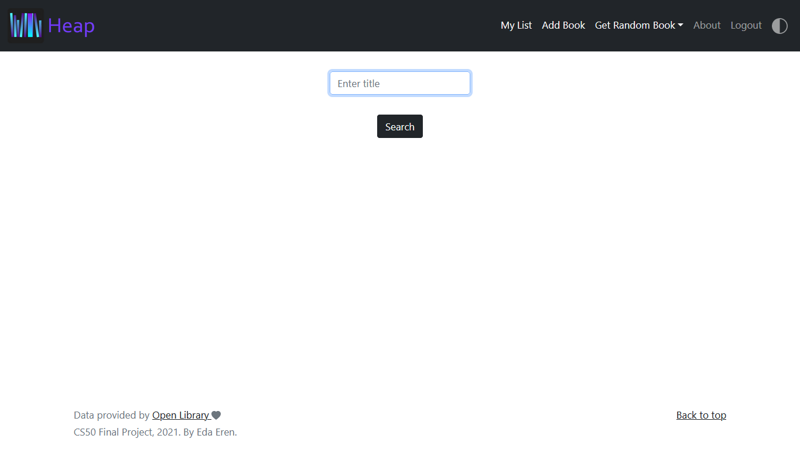

# Heap: For Reading Lists

Heap is created as an attempt to solve the problems of overwhelming TBR (to-be-read) lists. It is a web application built with Flask that lets the users create, analyze, and get recommendations from their reading list. 

As the saying goes, "so many books, so little time". When there are so many books to read, it becomes harder to manage your list, and this eventually leads to a less quality reading time. Heap tries to solve that problem, and lets you analyze and better sort out the books in your TBR list.

With it, you can
* Add books to your reading list
* See statistics for the number of pages and approximate reading time of the books in your list with auto-generated charts
* Get random book recommendations with number of pages or reading time range of your choosing

### Registering for an account
Only a username, a password, and estimated reading speed is required to register. Reading speed of the user is necessary for calculating the approximate reading time for the books. There are only three options to choose from: Slow, Average, and Fast. Calculating the reading time of the books is based on a simple idea that with average reading speed, it takes a minute to finish one page; with *slow*, two minutes; and with *fast*, half the minute. Of course, this is an oversimplification and may not necessarily reflect reality. However, many such tools online give varied results as well, so it is one approach to solve this problem.

### Creating your list
You can search for the title of the book you want to add to your list. After searching for title, you can choose an edition from the results that come up. Heap uses [Open Library APIs](https://openlibrary.org/developers/api) for all the data and embraces Open Library's vision for universal access to all knowledge. So if you cannot find the book you are searching for or find something missing, you can always [add or edit](https://openlibrary.org/account/login?redirect=/books/add) it there, and help build towards achieving that goal.

Search for title:

Choose edition:

### Overview Page
In your overview page, you can see a pie chart and a histogram that are auto-generated for the percentages of the books according to their number of pages, and for the estimated reading time range in hours and the number of books that fall in each range. The libraries Matplotlib and NumPy are used to plot the charts. You can also see each book grouped according to the number of pages they have, and an option (displayed as "−") to remove a book right below it. At the bottom of the page, there is also an option to delete your account if you wish to do so. You need to confirm your password in order to do that.

Overview Page | In Dark Mode

 
 

Books grouped according to their number of pages:

### Get randomly generated recommendations
You can get a random book recommendation from your list by the number of pages or reading time range that you specify. Python's `random` module is used for that purpose.

By Page | Result

 
 

By Time | Result

### Dark mode
You can toggle dark mode by clicking on the icon in the navigation bar. It is built with a very short and somewhat basic JavaScript code.

### Responsive design
Along with some custom CSS, Bootstrap 5.0 is used for responsive design.

Error pages are also customized, being rendered as `apology`. See templates/apology.html 

An example:

### Database
The application uses Python's built-in `sqlite3` module for database management. It is chosen for the reason that it is a lightweight tool for creating the project as a prototype.

### Requirements
The application requires the following packages:
* Flask=2.0.1
* Flask-Session=0.4.0
* matplotlib=3.4.2
* numpy=1.20.3
* requests=2.25.1

#### Video Demo:  https://youtu.be/atriZIc7y8c
